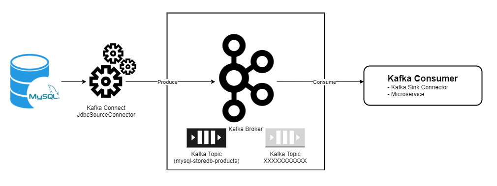
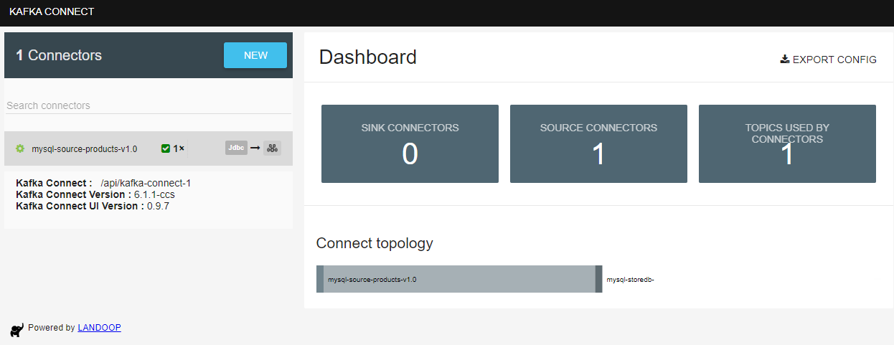
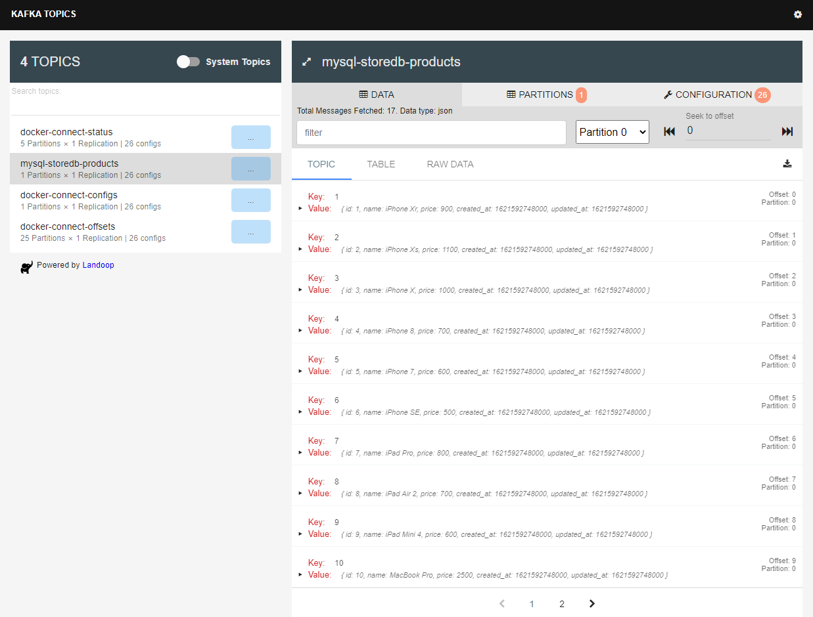
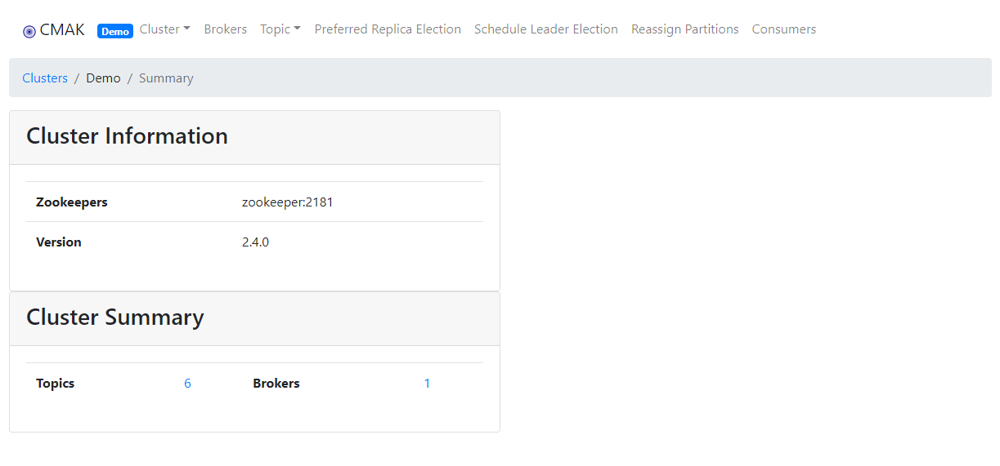

# Kafka Connect Sample

## Architecture


## Demo

### Setting up the environment:

1. Open a terminal inside the folder `kafka-connect-sample` and run:
```bash
docker-compose up -d
```

2. Create database schema and dump testing data:
```bash
cat connectors/mysql-source-products.sql | docker exec -i mysql-source mysql -u root -psecret storedb
```

3. Inside `kafka-connect-sample` (*important*), create topics:
```bash
./scripts/create-topics.sh
```

4. Inside `kafka-connect-sample` (*important*), create JDBC Source Connector:
```bash
./scripts/create-connectors.sh
```

### Results

- To check connectors state, open Kafka Connect UI from `http://localhost:8086`:

    

- To check topics state, open Kafka Topics UI from `http://localhost:8085`:

    

Kafka topic `mysql-storedb-products` successfuly received messages from Kafka JDBC Source Connector.

- To monitor Kafka Cluster, open Kafka Manager from `http://localhost:9000`:
    Create a new cluster with the following configuration:

    ```
    Cluster Name: Demo
    Cluster Zookeeper Hosts: zookeeper:2181
    [Checked] Enable JMX Polling
    [Checked] Poll consumer information  
    ```
    Go to cluster view:

    
